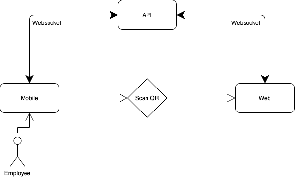

# Extry Application

## Sharif ICT MPM Event 1400

## Mobile Application to record Entry and Exits of a company employees

## What is Extry ?

Extry is entry and exit management system, that works with QR code, and doesn't need any specific hardwares. It has a main Back-end that generate and validate QR codes. In client's Front-end section, It will show the QR code that receives through websocket, when user want to record theirs entry/exit, user must scan the QR code through their smartphone with **Extry mobile application**, if QR code and the employee are valid, the record will be set either for entry or exit.

---

---

### Technologies Used: DotNet, SignalR, Angular, Flutter

**To run the project**:

`1. $ cd api && dotnet run --project Api`

`2. $ cd web && ng serve`

`3. $ cd app && flutter run`

_Please Note:_

> due i was testing in android studio emulator, websocket url is set to 10.0.2.2.
>
> for angular website, to avoid CORS problems please disable web security

---
